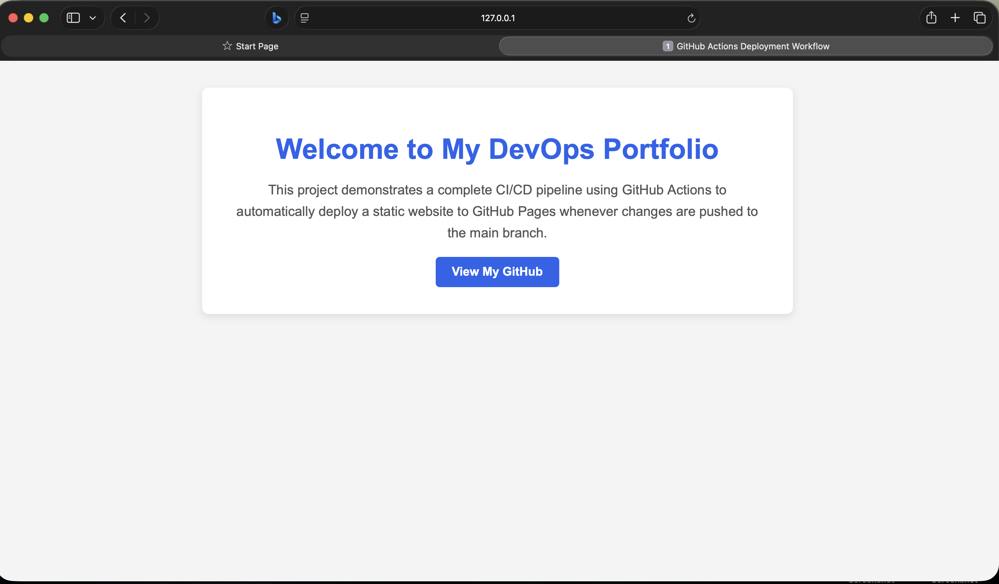
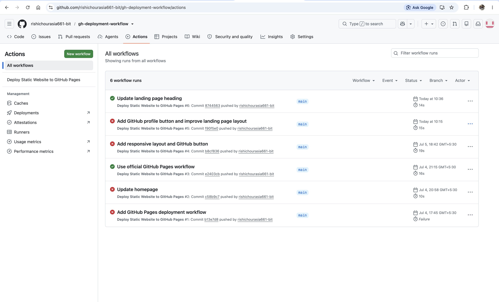
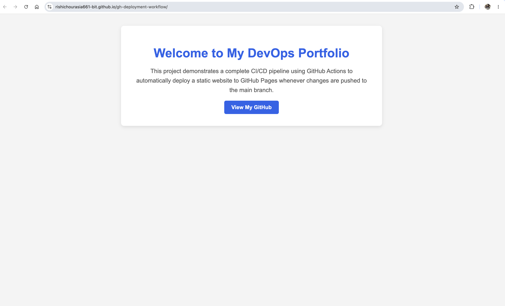
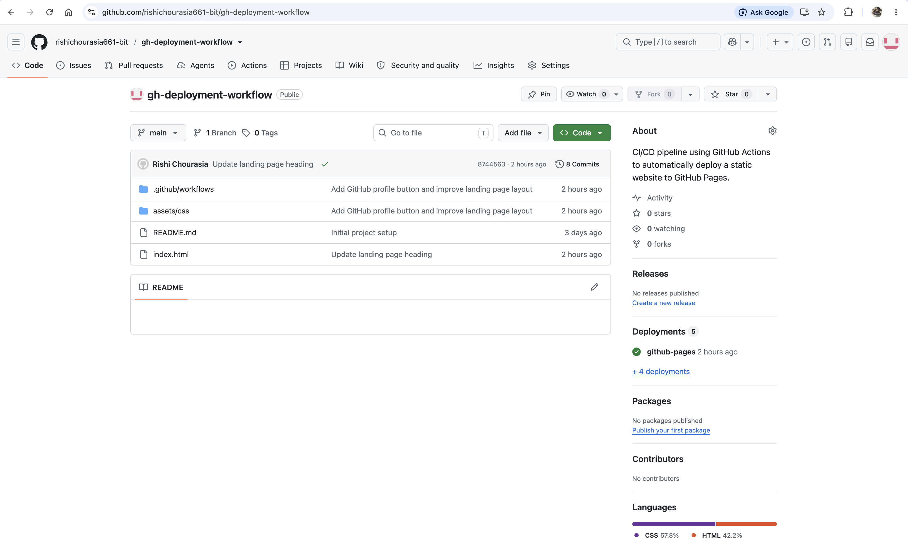

# GitHub Pages Deployment Workflow

This project demonstrates how to build and deploy a static website automatically using GitHub Actions and GitHub Pages.

## Project Overview
This project was created to learn Continuous Integration (CI) and Continuous Deployment (CD) using GitHub Actions.

Whenever changes are pushed to the main branch, GitHub automatically builds and deploys the website to GitHub Pages without any manual intervention.

## Features
- Static website built using HTML and CSS
- Version control with Git
- Source code hosted on GitHub
- Automated deployment using GitHub Actions
- Continuous Deployment to GitHub Pages
- Responsive and clean webpage layout

## Technologies Used
- HTML5
- CSS3
- Git
- GitHub
- GitHub Actions
- GitHub Pages
- Visual Studio Code

## Project Structure
gh-deployment-workflow/
│
├── .github/
│   └── workflows/
│       └── deploy.yml
│
├── assets/
│   ├── css/
│   │   └── style.css
│   ├── images/
│   └── js/
│
├── docs/
├── screenshots/
│
├── index.html
└── README.md

## CI/CD Workflow
The deployment process follows these steps:

1. Developer updates the source code.
2. Changes are committed locally using Git.
3. Code is pushed to the GitHub repository.
4. GitHub Actions automatically detects the push.
5. The workflow defined in `deploy.yml` starts.
6. GitHub provisions an Ubuntu runner.
7. The website files are uploaded as an artifact.
8. GitHub Pages deploys the latest version automatically.

## Run Locally
1. Clone the repository.

```bash
git clone https://github.com/rishichourasia661-bit/gh-deployment-workflow.git
```

2. Navigate into the project directory.

```bash
cd gh-deployment-workflow
```

3. Open the project in Visual Studio Code.

4. Start Live Server to preview the website.

## Live Demo
You can view the live website here:

**GitHub Pages:**  
https://rishichourasia661-bit.github.io/gh-deployment-workflow/

## Screenshots
### Homepage



### GitHub Actions Workflow



### GitHub Pages Deployment



### GitHub Repository

